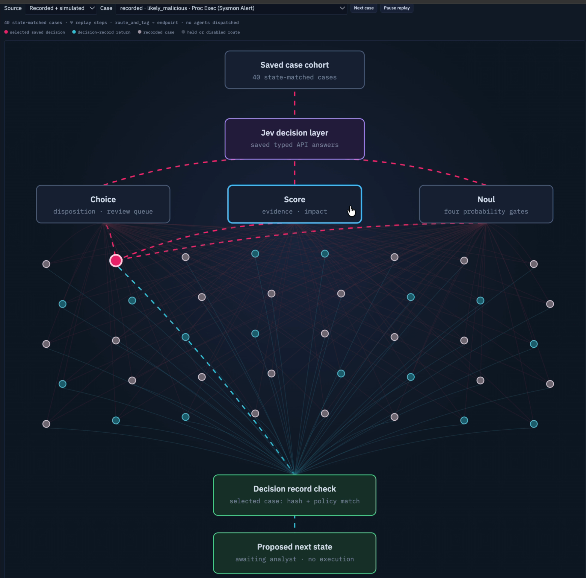
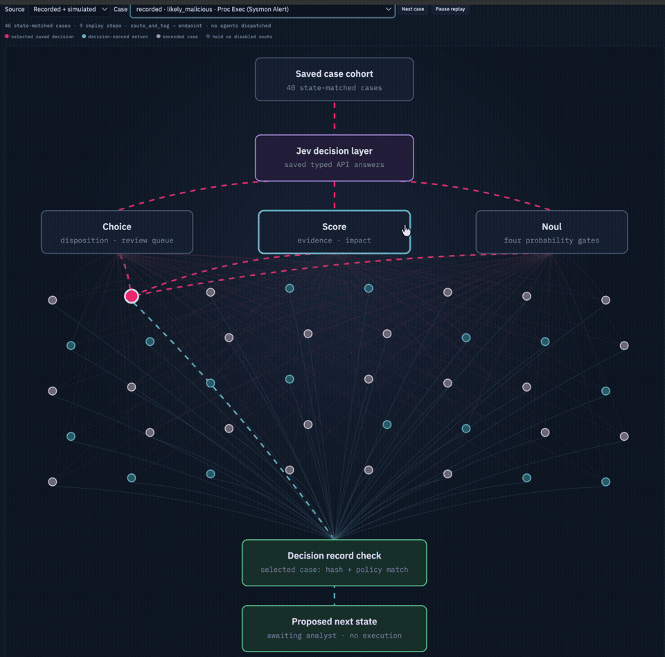

# Northstar SOC Lab

**A free, local workbench for reviewing security alerts and tracing typed
decisions.** Import your own alert records, replay saved Jev-style answers,
inspect the shadow-policy route, and record an independent analyst verdict.
The default synthetic company day is a sample project, not a requirement.

Northstar keeps case evidence, model judgments, policy, and human labels
separate. The console shows what was supplied, what the decision layer said,
why policy held or routed a case, and whether the saved decision still matches
the case state. It does not contain or change a real host.





The image and animation show the maintainer's saved Jev run over recorded
replay cases. They show decision records, not hidden model internals. The included
`examples/` files use **manually authored** typed answers so anyone can try
the flow without a model account. [See the showcase guide](docs/showcase.md).

## Try it in five minutes

Requires Python 3.9+, Bash, and a browser on macOS or Linux. The core demo has
no package install, Docker, model download, account, or paid API call.

```bash
git clone https://github.com/jahurier/northstar-soc-lab.git
cd northstar-soc-lab
./quickstart.sh
```

Open <http://127.0.0.1:8787>. Press Ctrl+C to stop. This starts a local,
deterministic synthetic day. Change the seed or omit planted scenarios with
`./quickstart.sh --seed 42` or `./quickstart.sh --no-attacks`.

To try the **bring-your-own-cases** path with two supplied, unlabeled alerts:

```bash
./quickstart.sh --no-sim --cases examples/cases.jsonl \
  --results examples/typed-results.jsonl
```

Open **Overview** for the imported-case count, **Triage** for the case table,
and **Jev decision map** for the two saved typed routes. The result file is
marked `manual-example`; it makes no Jev API call and is not an accuracy test.
The workbench serves only `127.0.0.1`. If port 8787 is occupied, add
`--port 8788` and open that port instead.

## Use your own data

1. Convert alerts to the [nine-field JSONL format](docs/user-guide.md). The
   importer rejects truth labels and marks the cases **unlabeled**.
2. Run `./quickstart.sh --no-sim --cases /path/to/alerts.jsonl`. Inspect and
   label cases in **Triage**; labels stay in ignored local files.
3. If you have a separately produced typed-result JSONL file, add
   `--results /path/to/results.jsonl`. Results must match the case ID, exact
   state SHA-256, and question version. The decision map then replays the
   result and checks the bundled `shadow-v4` policy. [Result format and
   workflow](docs/user-guide.md).

The free package supplies import, review, simulation, policy replay, and the
console. It does **not** bundle a Jev API runner or make paid calls. Local
Ollama notes, recorded telemetry replay, Elastic, and the disposable crAPI
range are optional integrations with separate setup.

## What you can inspect

| Area | Clean install | With your own data |
| --- | --- | --- |
| Synthetic simulator | Seeded company day and planted truth in a separate file | Change seed/date or turn off |
| Case workbench | Sample cases and modeled browser flow | Import unlabeled alert JSONL |
| Decision map | Empty by default | Replay state-matched typed results |
| Shadow policy | Bundled, non-executing `shadow-v4` | Recompute and compare each saved route |
| Analyst review | Empty local ledger | Save independent verdicts |
| Blue/Red/Elastic | Inactive | Optional local model, passive replay, isolated range |

The [architecture](docs/architecture.md), [deployment requirements](docs/deployment.md),
[safety and evidence rules](docs/safety-and-evidence.md), and
[five-minute walkthrough](docs/demo.md) explain each layer.

## Reference result, not a product benchmark

On the **same 23 planted synthetic cases**, a saved Jev run classified 21/23
correctly from single alerts and 22/23 with whole-chain context. Median saved
API latency was 304.3 ms and 289.0 ms respectively; p95 was 733.4 ms and
801.7 ms. [Definitions, token counts, and limits](docs/results.md) are in the
published aggregate. This small, inspected cohort does not measure your data,
production accuracy, end-to-end SOC speed, or a cross-model advantage.

## License and scope

Northstar source is released under [Apache-2.0](LICENSE). Optional tools,
models, Docker images, and recorded datasets have their own licenses and are
not redistributed here. This is a single-operator local workbench, not a
hosted multi-user SOC or an autonomous containment system. See the
[deployment guide](docs/deployment.md) before enabling optional integrations.
