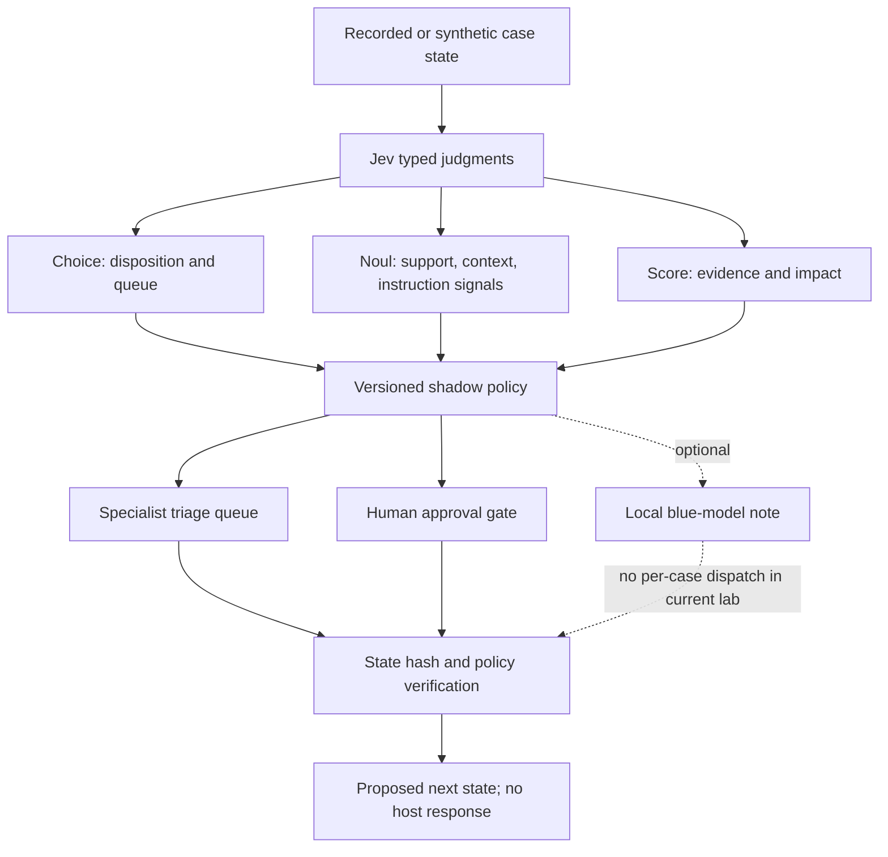

# Architecture and point of the lab

The design separates **judgment**, **policy**, **work**, and **verification**. Jev
can answer typed questions about a case. Code interprets those answers under a
versioned shadow policy. Agents and tools may collect or summarize evidence in
their own bounded roles. A human gate remains before consequential actions.

The **portable demo** runs only the simulator and console. The console's
browser animation is modeled. When separate Jev results are supplied, the
decision map replays saved typed outputs and checks that the current policy
reproduces the saved recommendation. This verifies a decision record, not a
downstream investigation or endpoint response.

The **recorded replay** path consumes external datasets, runs Hayabusa, builds
case state, and stores truth and observations separately. Source-folder labels
are weak: a recording may contain background activity. The analyst queue must
be labeled independently before it can support performance claims.

The **optional range** uses a disposable crAPI target and pinned scanner
components on an isolated Docker network. It is separate from the passive
replay and synthetic simulator. A plan and explicit activation gate bound each
live run; it cannot target arbitrary hosts through this console.

The intended future loop is state → typed decision → bounded route → evidence
work → verification → new state. Today's lab has pieces of that loop, with
human review and non-execution made explicit. It is not a 300-agent swarm.
